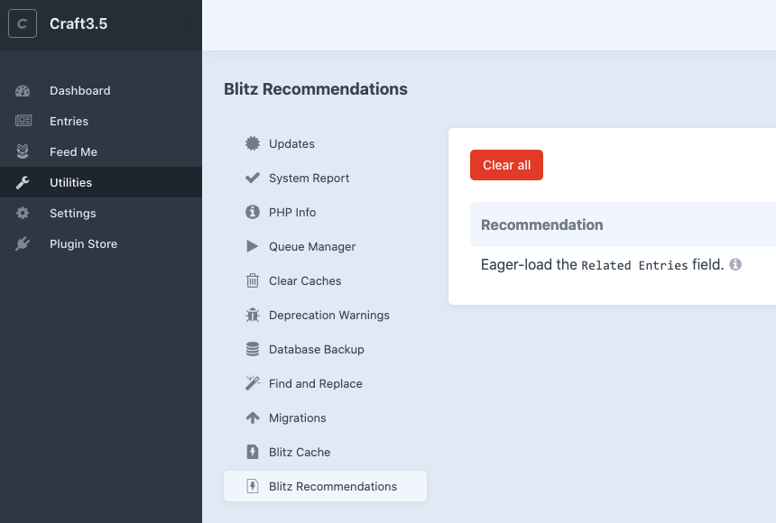
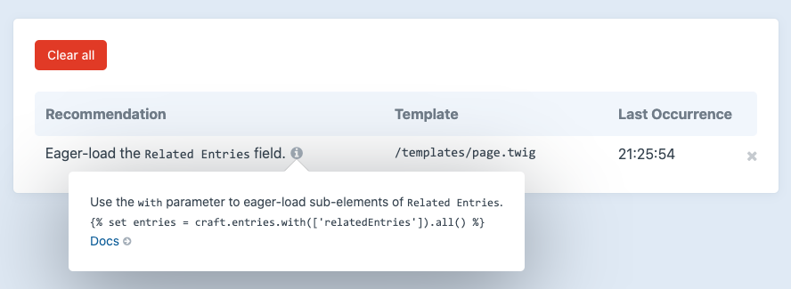

<p align="center"></p>

# Blitz Recommendations Plugin

Adds a utility that provides templating performance recommendations for Craft CMS 3.

While this plugin works seamlessly with the [Blitz](https://putyourlightson.com/plugins/blitz) plugin, there is no dependency between them. In other words, this plugin can be installed and used for free _without_ Blitz. 

> This plugin is currently in beta. Please contribute by reporting any bugs or issues.



## Recommendation Types

### Eager-Loading Recommendations

Recommendations for eager-loading sub-elements of relation fields.



## Requirements

Craft CMS 3.0.0 or later.

## Installation

Install the plugin using composer.

```
composer require putyourlightson/craft-blitz-recommendations:^1.0.0-beta.1
```

## License

This plugin is licensed for free under the MIT License.

<small>Created by [PutYourLightsOn](https://putyourlightson.com/).</small>
